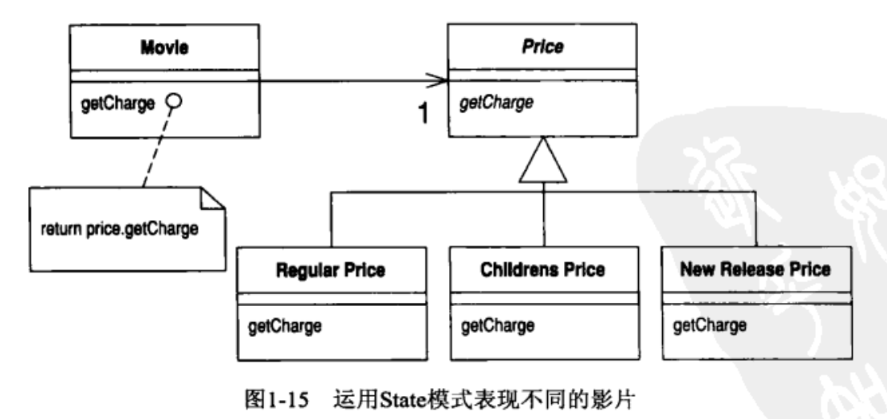

# Chapter 1 第一个案例 #
> 谈原理，很容易流于泛泛.实例可以拯救我于太虚之中
## 1.1 实例内容以及任性的代码 ##

### 实例描述:影片出租店 
---
计算每一位顾客的消费金额并打印详单
操作者告诉程序:顾客租了哪些影片,租期多长，程序根据租赁时间和影片类型算出费用
影片分为三类:普通片,儿童片，和新片
除了计算费用以外还要为常客计算积分，积分会根据租片的种类是否是新片而不同

### 源码

**tips**
> 如果你发现为程序添加一个特性特别麻烦，那么这时候此程序就需要重构
> 重构的程序应该很容易添加该特性

## 1.2 重构的第一步 ##
> 重构的第一步是建立有效的测试
> 好的测试是重构的根本
---
在这个案例中测试的机制就是statement的字符串输出

## 1.3 分解重组statement()函数 ##
```Java
public String statement(){
	double totalAmount=0;
	int frequentRenterPoints=0;
	Enumeration rentalsEnum=rentals.elements();
	String result="Rental Record for "+ getName()+"\n";
	while(rentalsEnum.hasMoreElements()){
		double thisAmount=0;
		Rental each=(Rental) rentalsEnum.nextElement();

		//determine amounts for each line
		switch(each.getMovie().getPriceCode()){
			case Movie.REGUALR:
				thisAmount+=2;
				if(each.getDaysRented()>2)
					thisAmount += (each.getDaysRented()-2)*1.5;
				break;
			case Movie.CHILDREN:
				thisAmount += 1.5;
				if(each.getDaysRented()>3)
					thisAmount += (each.getDaysRented()-3)*1.5;
				break;
			case Movie.NEW_RELEASE:
				thisAmount += each.getDaysRented()*3;
				break;

		}

		//add frequent renter points
		frequentRenterPoints++;
		// add bonus for a 2 day's new release rental
		if((each.getMovie().getPriceCode()== Movie.NEW_RELEASE)&& each.getDaysRented()>1)
			frequentRenterPoints++;
		//show figures for this rental
		result += "\t" + each.getMovie().getTitle()+"\t" +String.valueOf(thisAmount)+"\n";
		totalAmount += thisAmount;


	}

	//add footer lines
	result += "Amount owed is " + String.valueOf(totalAmount) +"\n";
	result += "You earned "+ String.valueOf(frequentRenterPoints)+ " frequent renter points";
	return result;
}

```
### `v1` 让代码块变小
* 代码块越小，代码的功能越容易管理
* 第一个步骤是找到代码中的逻辑泥团,运用Extract Method	
	* 本例中的逻辑泥团就是switch 语句,这样的逻辑应该放到独立函数中 
* 提炼函数
	* 找到函数中的局部变量和参数-- each 和 thisAmount
	* 前者未被修改，只是调用，后者会被修改
	* **任何不会被修改的变量都可以作为参数传进新函数**
	* thisAmount 作为唯一一个变量可以作为函数的返回值

```diff
public String statement(){
	double totalAmount=0;
	int frequentRenterPoints=0;
	Enumeration rentalsEnum=rentals.elements();
	String result="Rental Record for "+ getName()+"\n";
	while(rentalsEnum.hasMoreElements()){
		double thisAmount=0;
		Rental each=(Rental) rentalsEnum.nextElement();

		//determine amounts for each line
+		switch(each.getMovie().getPriceCode()){
+			case Movie.REGUALR:
+				thisAmount+=2;
+				if(each.getDaysRented()>2)
+					thisAmount += (each.getDaysRented()-2)*1.5;
+				break;
+			case Movie.CHILDREN:
+				thisAmount += 1.5;
+				if(each.getDaysRented()>3)
+					thisAmount += (each.getDaysRented()-3)*1.5;
+				break;
+			case Movie.NEW_RELEASE:
+				thisAmount += each.getDaysRented()*3;
+				break;
+
+		}
-		thisAmount =amountFor(each);

		//add frequent renter points
		frequentRenterPoints++;
		// add bonus for a 2 day's new release rental
		if((each.getMovie().getPriceCode()== Movie.NEW_RELEASE)&& each.getDaysRented()>1)
			frequentRenterPoints++;
		//show figures for this rental
		result += "\t" + each.getMovie().getTitle()+"\t" +String.valueOf(thisAmount)+"\n";
		totalAmount += thisAmount;


	}

	//add footer lines
	result += "Amount owed is " + String.valueOf(totalAmount) +"\n";
	result += "You earned "+ String.valueOf(frequentRenterPoints)+ " frequent renter points";
	return result;
}
- private double amountFor(Rental each){
- 	double thisAmount=0;
- 		switch(each.getMovie().getPriceCode()){
- 			case Movie.REGUALR:
- 				thisAmount+=2;
- 				if(each.getDaysRented()>2)
- 					thisAmount += (each.getDaysRented()-2)*1.5;
- 				break;
- 			case Movie.CHILDREN:
- 				thisAmount += 1.5;
- 				if(each.getDaysRented()>3)
- 					thisAmount += (each.getDaysRented()-3)*1.5;
- 				break;
- 			case Movie.NEW_RELEASE:
- 				thisAmount += each.getDaysRented()*3;
- 				break;
- 
- 		}
- 	return thisAmount;
- 
- 
- }
                                                     
```

### `v2` 修改新生成函数的变量名

> 任何一个傻瓜都能写出计算机可以理解的代码．唯有写出人类容易理解的代码才是优秀的程序员

```Java
 private double amountFor(Rental aRental){
 	double result =0;
 		switch(aRental.getMovie().getPriceCode()){
 			case Movie.REGUALR:
 				result+=2;
 				if(aRental.getDaysRented()>2)
 					result += (aRental.getDaysRented()-2)*1.5;
 				break;
 			case Movie.CHILDREN:
 				result += 1.5;
 				if(aRental.getDaysRented()>3)
 					result += (aRental.getDaysRented()-3)*1.5;
 				break;
 			case Movie.NEW_RELEASE:
 				result += aRental.getDaysRented()*3;
 				break;
 
 		}
 	return result;
 
 
 }
 
```

### `v3` 搬移"计算金额"的代码
* 这个函数使用了来自Rental类中的信息，却没有使用Customer的信息
* Move Method (142)
* 调整代码适应Rental类
```Java
public double getCharge(){
	double result=0;
	switch(getMovie().getPriceCode()){
		case Movie.REGULAR:
			result+=2;
			if(getDaysRented()>2)
				result += (getDaysRented()-2)*1.5;
			break;
		case Movie.CHILDREN:
			result += 1.5;
			if(getDaysRented()>3)
				result += (getDaysRented()-3)*1.5;
			break;
		case Movie.NEW_RELEASE:
			result += getDaysRented()*3;
			break;

	}
	return result;

}


```

### `v4` 提炼"常客积分计算"函数
* 常客积分计算和金额计算是类似的
* 第一步找到逻辑泥潭，Extract Method()
* 第二步更改变量名为人类可读
* 第三步搬移到Rental类中，因为此段代码变量是Customer需要的，可以作为返回值，而输入值只是读取，所以把函数放入读取的类中
```java
public int getFrequentRenterPoints(){
	int result=0;
	//add frequent renter points
	result++;
	// add bonus for a 2 day's new release rental
	if((getMovie().getPriceCode()== Movie.NEW_RELEASE)&& getDaysRented()>1)
		result++;
	return result;


}

```
### `v5` 去除临时变量,让代码块再变小
* 在statement函数中有两个临时变量totalAmount 和frequentRenterPoints
* 这两个临时变量是通过对遍历所有租用电影的向量池获取其最终的价值并打印
* 此书的观点是: 在遍历并不明显伤害运行时间的情况下要去除同一个函数中多个临时变量的求取过程
* statement函数的主要目的是打印，并不是求取这两个值
* 但是打印之前必须获取这两个值
* 结论是:增加两个函数单独计算totalAmount和totalFrequentRenterPoints.
```java
private double getTotalAmount(){
	double result=0;
	Enumeration rentalsEnum=rentals.elements();
	while(rentalsEnum.hasMoreElements()){
		double thisAmount=0;
		Rental each=(Rental) rentalsEnum.nextElement();

		thisAmount=each.getCharge();
		result += thisAmount;
	}
	return result;
}
private int getTotalFrequentRenterPoints(){

	int result=0;
	Enumeration rentalsEnum=rentals.elements();
	while(rentalsEnum.hasMoreElements()){
		Rental each=(Rental) rentalsEnum.nextElement();
		result+=each.getFrequentRenterPoints();
	}
	return result;


}

```
* 增加这两个函数并没有让计算机的负担减轻，但是人类的可阅读性增加了
* 实际上因为在每个函数中要引入遍历，计算机的负担是增加了的,这里面有一个权衡

## 1.4 运用多态取代与价格相关的条件逻辑 ##

* 从此节的题目中可以得到两个讯息
	* 条件逻辑是要尽量避免的
	* 多态是一个优秀的特性，可以用来解决部分条件逻辑问题

### `v1` 如何使用switch语句
* 最好不要在另一个对象的属性基础上运用switch语句
* 如果不得不使用switch,应该在对象自己的数据上使用
* 反例：Rental中getCharge()函数

```diff
+ public double getCharge(){
+ 	double result=0;
+ 	switch(getMovie().getPriceCode()){
+ 		case Movie.REGULAR:
+ 			result+=2;
+ 			if(getDaysRented()>2)
+ 				result += (getDaysRented()-2)*1.5;
+ 			break;
+ 		case Movie.CHILDREN:
+ 			result += 1.5;
+ 			if(getDaysRented()>3)
+ 				result += (getDaysRented()-3)*1.5;
+ 			break;
+ 		case Movie.NEW_RELEASE:
+ 			result += getDaysRented()*3;
+ 			break;
+ 
+ 	}
+ 	return result;
+ 
+ }

```
* 在这个反例中可以看到，getPriceCode是switch的判断条件
* 这也暗示我们getCharge应该放到Movie类中去
```diff
- class Rental ...
- 	public double getCharge(){
- 		return movie.getCharge(daysRented);
- 
- 	}
- class Movie ...
- 	public double getCharge(int daysRented ){
- 		double result=0;
- 		switch(getPriceCode()){
- 			case Movie.REGULAR:
- 				result+=2;
- 				if(daysRented>2)
- 					result += (daysRented-2)*1.5;
- 				break;
- 			case Movie.CHILDREN:
- 				result += 1.5;
- 				if(daysRented>3)
- 					result += (daysRented-3)*1.5;
- 				break;
- 			case Movie.NEW_RELEASE:
- 				result += daysRented*3;
- 				break;
- 
- 		}
- 		return result;
- 
- 	}
- 
- 
- 
```

```
getCharge函数是我们自己主动改编的，但是仍然是有其问题，需要进一步重构
这里也是提醒我们，重构很难一步完成，需要多步，小步,一点点优化
在优化的过程中，要允许不符合重构原则的代码出现，即便这个代码由你本人完成
操之过急的结果是仍然需要重构，得不偿失
```
* 以相同的手法将计算常客积分的函数也搬移到Movie的类中，原因同上

### `v2` 给Movie实现多态取代switch语句
* switch 语句的工作可以被子类代替，给Movie建立三个子类，每一个子类有自己的计费方法getCharge()
* 在创建对象的时候实现多态，这样的getCharge函数也被重写
```java
class RegularMovie extends Movie{

	public double getCharge(int daysRented ){
		double result=0;
		result+=2;
		if(daysRented>2)
			result += (daysRented-2)*1.5;

		return result;

	}


}

class ChildrenMovie extends Movie{

	public double getCharge(int daysRented ){
		double result=0;
		result += 1.5;
		if(daysRented>3)
			result += (daysRented-3)*1.5;


		return result;

	}


}

class NewReleaseMovie extends Movie{

	public double getCharge(int daysRented ){
		double result=0;
		result += daysRented*3;
		return result;

	}


}
```
### `v3-5` 增加State模式
* 其实代码改到这里，对于这个小程序来讲，重构已经大致完成
* 作者在此处有意通过这个小案例来引入设计模式的想法，因此在此小节会看起来让程序变得繁琐了，但是实际上更加健壮，可维护
* 添加State模式[Gang of Four]的动机
	* 一个影片在生命周期中是可以改变分类的，比如刚刚上映的片子经过一段时间后可以变成儿童片或者普通片
	* 但是一个对象却不可以在生命周期中修改自己所属于的类
* 什么是State模式?
	* 加入一个间接性的类Price，在Price类的对象中进行子类化动作,于是可以在任何必要时候修改价格


* 实现State模式的三个重构手法
	* 首先回到本节v1,即switch 没有多态的状况
	* Replace Type Code with State/Strategy(227),将与类型相关的行为搬至State模式下
	* 运用Move Method(142)将switch语句移动到Price类中
	* 最后运用Repalce Conditional with Polymorphism(255)去掉switch语句
```
看不懂State模式没关系，现在还没有学呢，目前可以只是看看经过State模式后代码的变化
```

### `v3` 添加抽象类Price 作为中间State
* priceCode的因为需要被其他类多次调用,应该为其设置取值函数,即便是构造函数仍然直接访问价格代码
* 设置抽象类Price,及其子类实现
* 在Movie类中switch中利用抽象类实现多态
```diff
public class Movie{
	public static final int CHILDREN =3;
	public static final int REGULAR =2;
	public static final int NEW_RELEASE =4;

	private String title;
+	private int priceCode;
-	private Price price;

	public Movie(String titile,int priceCode){
		this.title=title;
+		this.priceCode=priceCode;
-		setPriceCode(priceCode);
	}

	public int getPriceCode(){
+		return priceCode;
-		return price.getPriceCode();
	}
	public void setPriceCode(int arg){
+		priceCode=arg;

-		switch(arg){
-			case REGULAR:
-				price = new RegularPrice();
-				break;
-			case CHILDREN:
-				price = new ChildrenPrice();
-				break;
-			case NEW_RELEASE:
-				price = new NewReleasePrice();
-				break;
-			default:
-				throw new IllegalArgumentException("Incorrect Price Code");
-
-
-		}

	}

	public String getTitle(){
		return title;
	}
	public void setTitle(String arg){
		title=arg;
	}

	public double getCharge(int daysRented ){
		double result=0;
		switch(getPriceCode()){
			case Movie.REGULAR:
				result+=2;
				if(daysRented>2)
					result += (daysRented-2)*1.5;
				break;
			case Movie.CHILDREN:
				result += 1.5;
				if(daysRented>3)
					result += (daysRented-3)*1.5;
				break;
			case Movie.NEW_RELEASE:
				result += daysRented*3;
				break;

		}
		return result;

	}
	public int getFrequentRenterPoints(int daysRented){
		int result=0;
		//add frequent renter points
		result++;
		// add bonus for a 2 day's new release rental
		if((getPriceCode()== Movie.NEW_RELEASE)&& daysRented>1)
			result++;
		return result;
	}
}
- abstract class Price{
- 	abstract int getPriceCode();
- 
- }
- class ChildrenPrice extends Price{
- 	int getPriceCode(){
- 		return Movie.CHILDREN;
- 	}
- }
- 
- class RegularPrice extends Price{
- 	int getPriceCode(){
- 		return Movie.REGULAR;
- 	}
- }
- class NewReleasePrice extends Price{
- 	int getPriceCode(){
- 		return Movie.NEW_RELEASE;
- 	}
- }
```
### `v4` Move Method(142)
* 将getCharge搬移到Price类中
* 这里就不展示代码了，十分简单
### `v5` Replace Conditional with Polymorphism(255)
* 这句话的含义是将v2中实现的子类用多态表达，在这里实现,当然这是我个人的理解,暂时先这样写
```java
abstract class Price{
	abstract int getPriceCode();
	abstract double getCharge(int daysRented );
}

class ChildrenPrice extends Price{
	int getPriceCode(){
		return Movie.CHILDREN;
	}
	public double getCharge(int daysRented ){
		double result=0;
		result += 1.5;
		if(daysRented>3)
			result += (daysRented-3)*1.5;
		return result;
	}
}

class RegularPrice extends Price{
	int getPriceCode(){
		return Movie.REGULAR;
	}

	public double getCharge(int daysRented ){
		double result=0;
		result+=2;
		if(daysRented>2)
			result += (daysRented-2)*1.5;

		return result;

	}

}
class NewReleasePrice extends Price{
	int getPriceCode(){
		return Movie.NEW_RELEASE;
	}
	public double getCharge(int daysRented ){
		double result=0;
		result += daysRented*3;
		return result;

	}


}
```
* v2 和 v5区别是什么?
	* 这也是State模式的设计动机
	* v2中的子类仍然是Movie，当顾客购买片子进行初始化的时候，Movie 的价格也就确定了
	* v5中将Movie分成Movie和Price两部分，或者说将Movie的更加细分了，这样即便顾客仍然购买同一张片子，随着时间的不同,他的价格是可以随意调节的
	* 换句话说:电影的价格既取决于商品本身的品质，同时又相对独立．这个模型本身是更加符合真是的实际情况
* 同样的思路移动getFrequentRenterPoints函数
```java
class NewReleasePrice ...
	public int getFrequentRenterPoints(int daysRented){
		return (daysRented>1)? 2:1;
	}
```
* 我们可以看到原来应用于新片的额外积分有一个逻辑判断: (这是个新片&& 租期大于一天)．这里已经简化了．判断新片的转换已经由setPriceCode函数默默承担了
* 这里也是告诉我们一个小感受：逻辑判断太长，重复判断等等一定有办法去除.
* 长的逻辑是可以被拆分的,好的逻辑是简洁的
* 引入State 模式花了很大的功夫，对于一个简单的程序来说是有点累赘的，但是同样也带来了State模式的好处:任何修改与价格相关的操作都变得简单，无论是添加或者删除
* 这个程序的其他部分是不知道使用了State模式

## 1.5 结语 ##
> 这个例子给我们最大的启发就是重构的节奏: 测试，小修改，测试，小修改，... 正是这种节奏让重构得以快速而安全的进行
